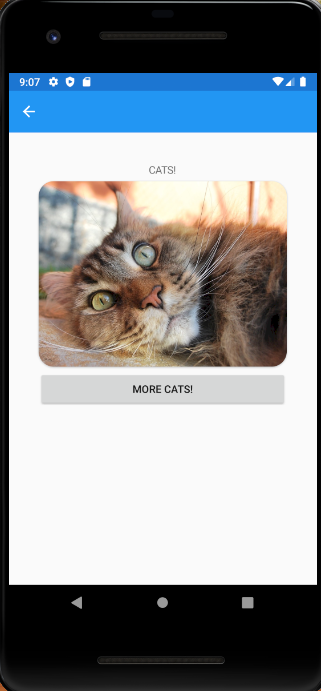

# Xamarin
## Project Cats

---
## Web Application
Mobile application utilizing Xamarin that calls out to a cat API to display random cat images. User has the ability to click a button to look at more cats.

## Tools Used
- Visual Studio 2019
- C#
- Xamarin
- Newtonsoft
- ASP.Net Core

---
## Getting Started
Clone this repository to your local machine.
```
git clone https://github.com/areyes986/Xamarin.git
```
---

### Visual


---

### Step through
* The visual here is what the user sees when they enter the mobile application.
* User then can click `More Cats` button to display more cats.

## Model Properties and Requirements
### Cats
| Parameter | Type | Required |
| --- | --- | --- |
| id  | string | No |
| url | string | YES |
| width | string | NO |
| height | string | NO |

---
## Authors
* Allyson Reyes
* Harlen Lopez
* Joseph Hangarter
* Brody Rebne
---


